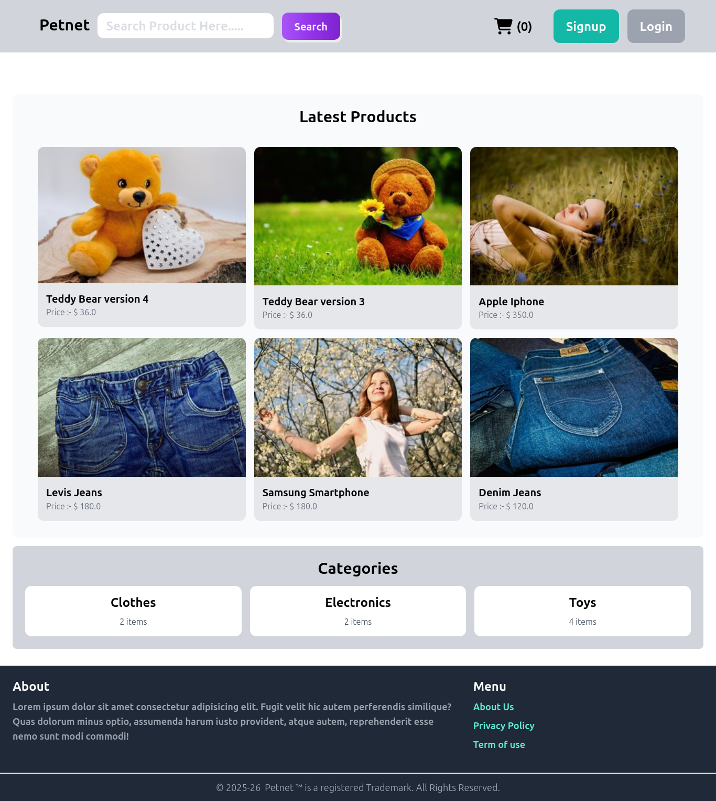
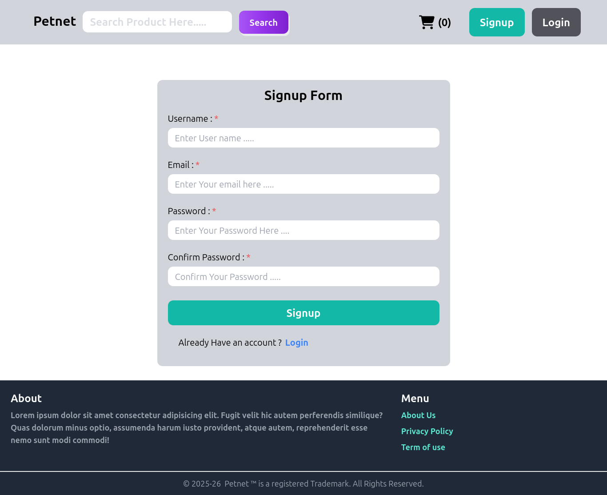
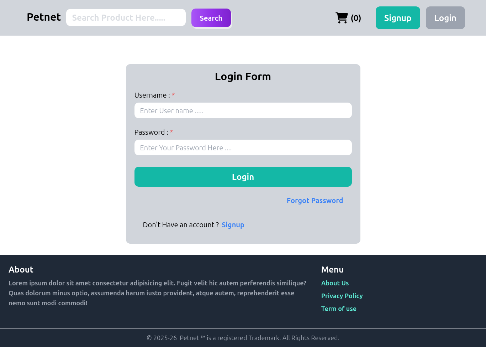
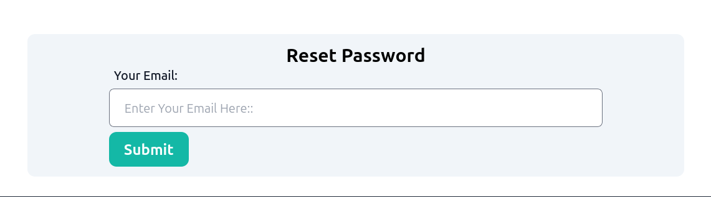
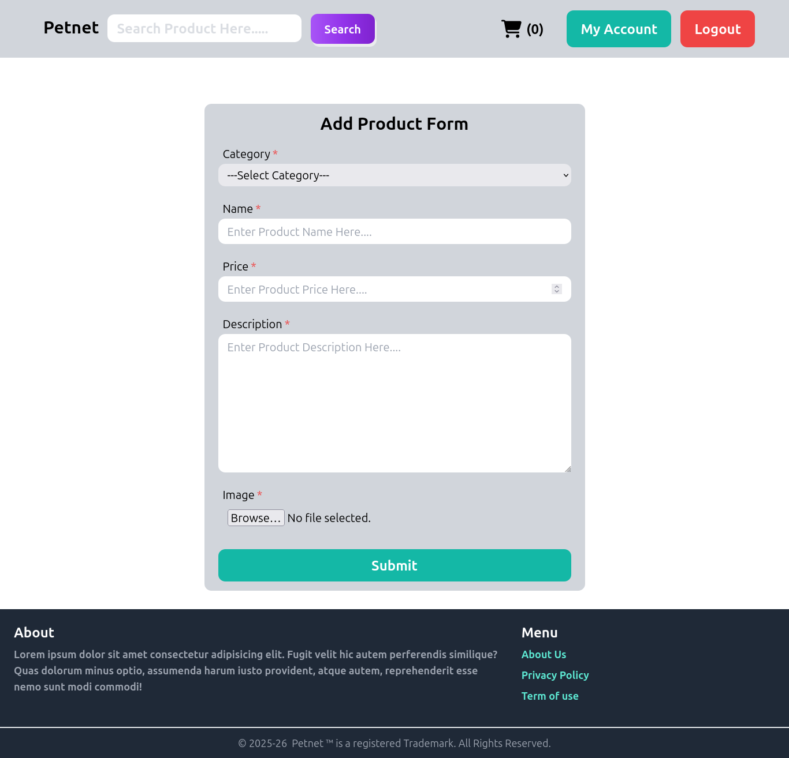
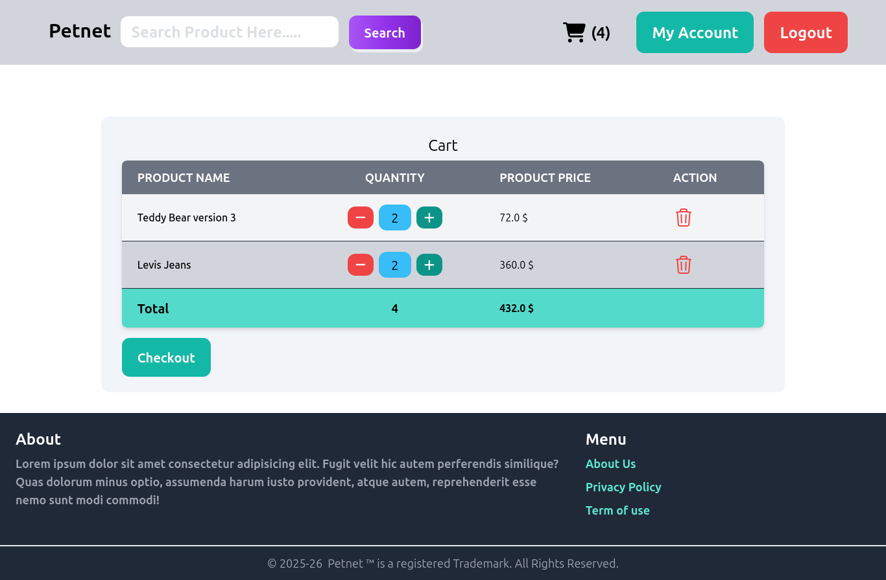
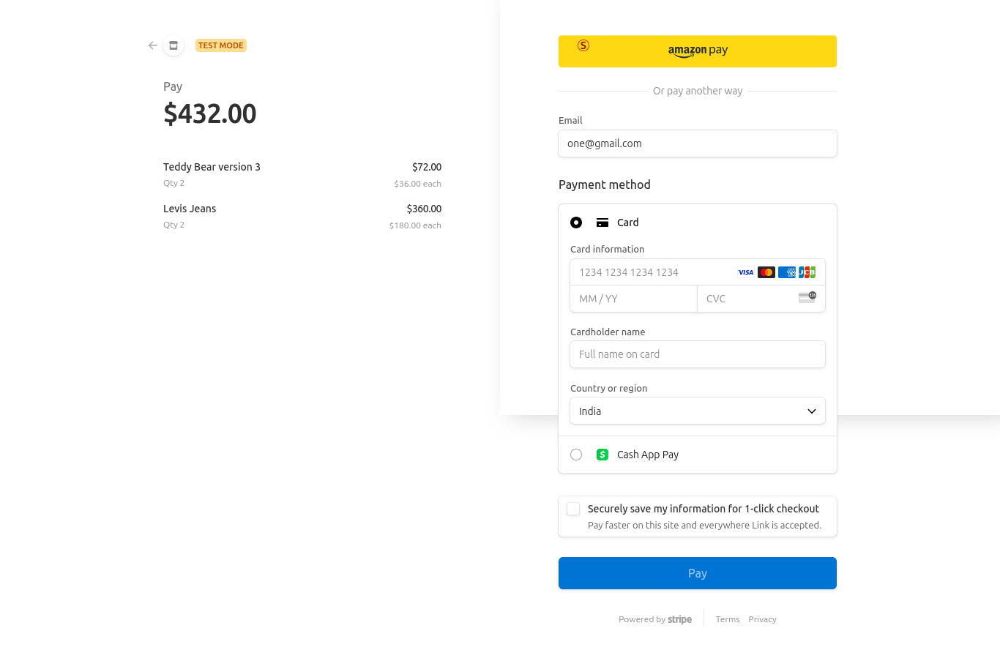

# 🐾 Petnet - Micro eCommerce Platform

**Petnet** is a lightweight eCommerce web application built using **Django** and styled with **Tailwind CSS**. The platform allows users to browse, buy, and manage products with ease. It includes core features like user authentication, product management, cart handling, and payment integration via **Stripe**.

---

## 🚀 Features

### 🔐 User Authentication
- Login
- Signup
- Logout
- Forgot Password / Password Reset

### 📦 Product Management
- Add New Product
- Edit Product
- Delete Product
- Update Product Details

### 🛒 Shopping Cart
- Add to Cart
- Update Cart
- Checkout

### 💳 Payment Integration
- Integrated with **Stripe** for secure payments

---

## 📸 Screenshots

### 🏠 Home Page

### 📝 Signup Page

### 🔐 Login Page

### Forgot Password 

### 🛍️ Product List Page

### ➕ Add Product Page

### 🛒 Cart Page

### 💳 Checkout Page

---

## ⚙️ Tech Stack

- **Backend:** Django
- **Frontend:** Tailwind CSS
- **Database:** SQLite 
- **Payment Gateway:** Stripe

---

